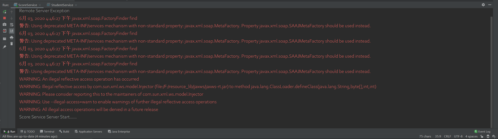
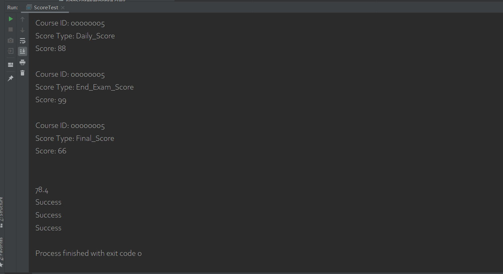
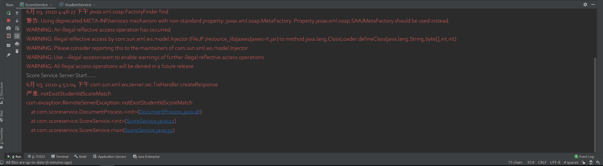
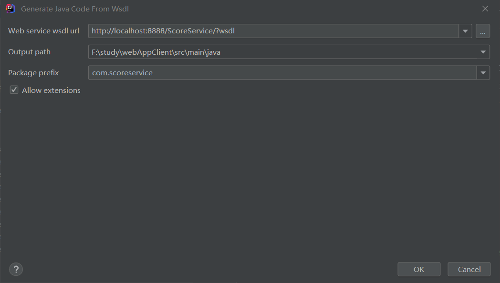
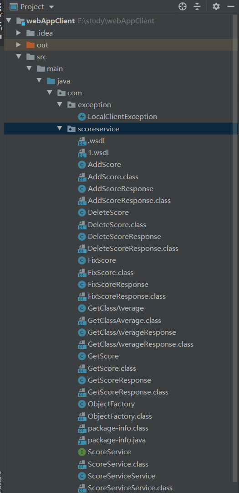

# 测试运行

作业7与作业8，分为Score与Student服务

使用Score服务时，将.\webApp\src\main\java\com\scoreservice\ScoreService.java中的srcPath修改为（本地位置\webApp\\src\\scoreList.xml），并运行



之后再运行.\webAppClient\src\main\java\com\test\ScoreTest.java作为测试，将会有对应的打印结果，发生异常时，在server端可以看到错误信息，同时两边运行都会终止

（成功时客户端截图）



（服务端报错截图）



使用Student服务时，将.\webApp\src\main\java\com\studentservice\StudentService.java中的srcPath修改为（本地位置\webApp\\src\\studentList.xml），并运行

之后再运行.\webAppClient\src\main\java\com\test\StudentTest.java作为测试，将会有对应的打印结果，发生异常时，在server端可以看到错误信息，同时两边运行都会终止

# 作业报告

以作业7的Score服务为例。

编写ScoreService.java，main函数中用endPoint发布服务

```java
Endpoint.publish("http://localhost:8888/ScoreService/",new ScoreService());
```

详细实现在DocumentProcess.java类中

在Client端使用Generate Java Code from WSDL，使用http://localhost:8888/ScoreService/?wsdl生成客户端代码。





编写ScoreTest测试类测试运行

数据操作为直接操作XML文件